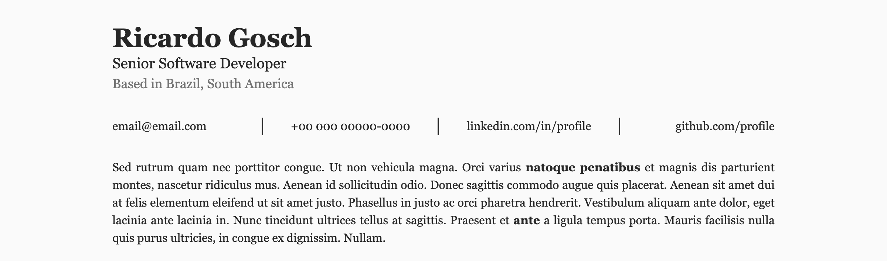

# Gosch Resume Client

A modern, multi-language resume application built with Next.js 16, featuring server-side rendering, internationalization with next-international, and a headless CMS integration.

<div align="center">
  
</div>

<p align="center">
  <em>Multi-language resume with automatic locale detection (English & Portuguese)</em>
</p>

## Features

- **Multi-language Support**: English (en-US) and Portuguese (pt-BR) with automatic locale detection
- **Server-Side Rendering**: Fast initial page loads with Next.js App Router
- **Type-Safe**: Full TypeScript support with strict mode enabled
- **Internationalization**: Powered by `next-international` for seamless i18n
- **Headless CMS Integration**: Dynamic content from Strapi backend
- **Rich Text Rendering**: Support for formatted content using Strapi blocks renderer
- **SEO Optimized**: Locale-specific metadata and Open Graph images
- **Print-Friendly**: Optimized CSS for A4 printing
- **Modern Styling**: Tailwind CSS 4 with custom resume components
- **Code Quality**: ESLint, Prettier, and Husky pre-commit hooks

## Tech Stack

- **Framework**: [Next.js 16](https://nextjs.org/) with App Router
- **Language**: [TypeScript 5.9](https://www.typescriptlang.org/)
- **UI Library**: [React 19](https://react.dev/)
- **Styling**: [Tailwind CSS 4](https://tailwindcss.com/)
- **Internationalization**: [next-international](https://next-international.vercel.app/)
- **Rich Text**: [@strapi/blocks-react-renderer](https://www.npmjs.com/package/@strapi/blocks-react-renderer)
- **Date Formatting**: [date-fns](https://date-fns.org/)
- **Code Quality**: ESLint, Prettier, Husky

## Backend Repository

This is the frontend client for the resume application. The backend API is built with Strapi and can be found at:

**[gosch-resume-api](https://github.com/ohgosch/gosch-resume-api)**

You'll need to set up and run the backend before using this client application.

## Getting Started

### Prerequisites

- Node.js >= 18.0.0
- Yarn >= 1.22.0
- A running Strapi backend instance (see [gosch-resume-api](https://github.com/ohgosch/gosch-resume-api))

### Installation

1. Clone the repository:

```bash
git clone <repository-url>
cd gosch-resume-client
```

2. Install dependencies:

```bash
yarn install
```

3. Create a `.env` file in the root directory:

```bash
cp .env.example .env
```

4. Configure your environment variables:

```env
API_HOST=http://localhost:1337
API_TOKEN=your_strapi_api_token
NEXT_PUBLIC_URL=http://localhost:3000
```

### Development

Run the development server with Turbopack:

```bash
yarn dev
```

Open [http://localhost:3000](http://localhost:3000) to view the application.

The app will automatically detect your browser's language preference and redirect to the appropriate locale (`/en-US` or `/pt-BR`).

### Building for Production

Build the application:

```bash
yarn build
```

Start the production server:

```bash
yarn start
```

### Linting

Run ESLint to check code quality:

```bash
yarn lint
```

## Project Structure

```
gosch-resume-client/
├── src/
│   ├── app/                     # Next.js App Router
│   │   ├── [lang]/              # Locale-based routing
│   │   │   ├── layout.tsx       # Lang-specific layout with i18n provider
│   │   │   ├── page.tsx         # Main resume page
│   │   │   ├── globals.css      # Global styles and Tailwind
│   │   │   └── cover-letter/    # Cover letter pages
│   │   ├── layout.tsx           # Root HTML layout
│   │   └── not-found.tsx        # 404 fallback
│   ├── components/              # React components
│   │   ├── Header/              # Resume header component
│   │   └── RichText/            # Rich text renderer
│   ├── interfaces/              # TypeScript type definitions
│   │   ├── api.d.ts             # API response types
│   │   └── resume.d.ts          # Resume data types
│   ├── locales/                 # Internationalization
│   │   ├── i18n.config.ts       # i18n configuration
│   │   ├── client.ts            # Client-side i18n setup
│   │   ├── server.ts            # Server-side i18n setup
│   │   └── dictionaries/        # Translation files
│   │       ├── en-US.ts         # English translations
│   │       └── pt-BR.ts         # Portuguese translations
│   ├── services/                # API services
│   │   └── resume.service.ts    # Resume data fetching
│   ├── utils/                   # Utility functions
│   │   ├── format.ts            # Date and phone formatting
│   │   └── seo.ts               # SEO metadata generation
│   └── proxy.ts                 # i18n middleware
├── public/                      # Static assets
│   └── img/seo/                 # SEO images
├── .env                         # Environment variables (not in git)
├── .env.example                 # Environment variables template
├── next.config.ts               # Next.js configuration
├── tsconfig.json                # TypeScript configuration
├── tailwind.config.ts           # Tailwind CSS configuration
├── eslint.config.mjs            # ESLint configuration
└── package.json                 # Project dependencies
```

## Internationalization (i18n)

This project uses `next-international` for internationalization, providing a type-safe and performant i18n solution for Next.js.

### How it Works

#### 1. Configuration

The i18n configuration is defined in `src/locales/i18n.config.ts`:

```typescript
export const i18n = {
  defaultLocale: 'en-US',
  locales: ['en-US', 'pt-BR'],
} as const;

export type TLang = (typeof i18n)['locales'][number];
```

#### 2. Middleware for Locale Detection

The `src/proxy.ts` file implements middleware that:

- Reads the `Accept-Language` header from incoming requests
- Uses `@formatjs/intl-localematcher` for intelligent locale matching
- Falls back to `en-US` if no matching locale is found
- Implements `urlMappingStrategy: 'rewriteDefault'` for clean URLs

```typescript
function resolveLocaleFromRequest(request: NextRequest): TLang {
  const acceptLanguages = String(request.headers.get('accept-language')).split(
    ',',
  );
  const acceptLanguagesFiltered = acceptLanguages.filter((language) =>
    i18n.locales.includes(language as TLang),
  );

  return match(
    acceptLanguagesFiltered,
    i18n.locales,
    i18n.defaultLocale,
  ) as TLang;
}
```

The middleware is configured to run on all routes except:

- API routes (`/api/*`)
- Static files (`/static/*`)
- Next.js internals (`/_next/*`)
- Special files (`favicon.ico`, `robots.txt`)

#### 3. Server-Side i18n

For Server Components, use the utilities from `src/locales/server.ts`:

```typescript
import { getI18n, getStaticParams } from '@/locales/server';

// In your page component
export async function generateStaticParams() {
  return getStaticParams(); // Returns [{ lang: 'en-US' }, { lang: 'pt-BR' }]
}

export default async function Page({ params }: { params: { lang: string } }) {
  const t = await getI18n();

  return (
    <div>
      <h1>{t('title')}</h1>
    </div>
  );
}
```

#### 4. Client-Side i18n

For Client Components, wrap your content with `I18nProviderClient`:

```typescript
'use client';

import { I18nProviderClient } from '@/locales/client';

export default function Layout({ children, params }) {
  return (
    <I18nProviderClient locale={params.lang}>
      {children}
    </I18nProviderClient>
  );
}
```

#### 5. Translation Dictionaries

Translation files are located in `src/locales/dictionaries/`:

**en-US.ts:**

```typescript
export default {
  modality: 'Modality',
  current: 'Current',
  experiences: 'Experiences',
  // ... more translations
} as const;
```

**pt-BR.ts:**

```typescript
export default {
  modality: 'Modalidade',
  current: 'Atual',
  experiences: 'Experiências',
  // ... more translations
} as const;
```

#### 6. URL Structure

The application uses dynamic routing with the `[lang]` segment:

- `/en-US` - English version
- `/pt-BR` - Portuguese version
- `/` - Redirects to detected locale

All pages under `src/app/[lang]/` automatically receive the locale parameter.

#### 7. Setting Locale Context

In async Server Components, set the locale context for proper i18n resolution:

```typescript
import { setStaticParamsLocale } from 'next-international/server';

export default async function Page({ params }: PageProps) {
  const { lang } = await params;
  setStaticParamsLocale(lang);

  // Now all i18n calls will use the correct locale
}
```

### Adding New Translations

1. Add the key-value pair to both dictionary files:
   - `src/locales/dictionaries/en-US.ts`
   - `src/locales/dictionaries/pt-BR.ts`

2. Use the translation in your components:

   ```typescript
   const t = await getI18n();
   <p>{t('yourNewKey')}</p>
   ```

3. TypeScript will automatically infer the available keys and provide autocomplete.

### Adding New Locales

1. Update `src/locales/i18n.config.ts`:

   ```typescript
   export const i18n = {
     defaultLocale: 'en-US',
     locales: ['en-US', 'pt-BR', 'es-ES'], // Add new locale
   } as const;
   ```

2. Create a new dictionary file:

   ```typescript
   // src/locales/dictionaries/es-ES.ts
   export default {
     modality: 'Modalidad',
     // ... translations
   } as const;
   ```

3. Update `src/locales/client.ts` and `src/locales/server.ts`:

   ```typescript
   export const { I18nProviderClient } = createI18nClient({
     'en-US': async () => await import('./dictionaries/en-US'),
     'pt-BR': async () => await import('./dictionaries/pt-BR'),
     'es-ES': async () => await import('./dictionaries/es-ES'),
   });
   ```

4. Create locale-specific SEO images in `public/img/seo/` if needed.

## API Integration

The application fetches data from a Strapi backend ([gosch-resume-api](https://github.com/ohgosch/gosch-resume-api)). Configure the API connection in your `.env` file:

```env
API_HOST=http://localhost:1337
API_TOKEN=your_strapi_api_token
```

> **Note**: You need to set up and run the backend API first. Follow the instructions in the [gosch-resume-api repository](https://github.com/ohgosch/gosch-resume-api) to get started.

### Available API Services

The `src/services/resume.service.ts` provides functions to fetch:

- **getSkeleton(locale)**: User profile data (name, title, location, about, contact info)
- **getExperiences(locale, limit)**: Work experiences with skills
- **getCourses(locale)**: Education and courses
- **getSkillsSection(locale)**: Skills organized by categories
- **getCompanyCoverLetterList()**: Available cover letters
- **getCompanyCoverLetterItem(documentId)**: Specific cover letter content

All services automatically include:

- Locale-specific content
- Bearer token authentication
- 300-second timeout
- Proper error handling

## Environment Variables

| Variable          | Description                     | Required | Default                 |
| ----------------- | ------------------------------- | -------- | ----------------------- |
| `API_HOST`        | Strapi backend URL              | Yes      | `http://localhost:1337` |
| `API_TOKEN`       | Strapi API authentication token | Yes      | -                       |
| `NEXT_PUBLIC_URL` | Public URL for SEO metadata     | Yes      | -                       |

## SEO

The application includes comprehensive SEO optimization:

- Locale-specific meta tags
- Open Graph images for social sharing
- Twitter Card support
- Language alternates for all locales
- Structured metadata generation

SEO images are located in `public/img/seo/`:

- `card_en-US.png` - English version
- `card_pt-BR.png` - Portuguese version

## Styling

The project uses Tailwind CSS 4 with custom components defined in `src/app/[lang]/globals.css`:

- `.section-title`: Section headers with accent bars
- `.section`: Section containers
- `.tag`: Skill tags
- `.rich-container`: Rich text content formatting
- `.menu-item`: Contact information menu items

Print styles are included for A4 page formatting.

## Scripts

- `yarn dev` - Start development server with Turbopack
- `yarn build` - Build production bundle
- `yarn start` - Start production server
- `yarn lint` - Run ESLint
- `yarn prepare` - Install Husky git hooks

## Contributing

1. Create a feature branch from `main`
2. Make your changes
3. Run `yarn lint` to ensure code quality
4. Commit with descriptive messages
5. Push and create a pull request

Pre-commit hooks will automatically:

- Run ESLint on staged files
- Format code with Prettier
- Ensure import statements are sorted

## License

This project is licensed under the MIT License - see the [LICENSE](LICENSE) file for details.

Copyright (c) 2025 Ricardo Gosch

## Support

For issues and questions, please open an issue on the repository.
